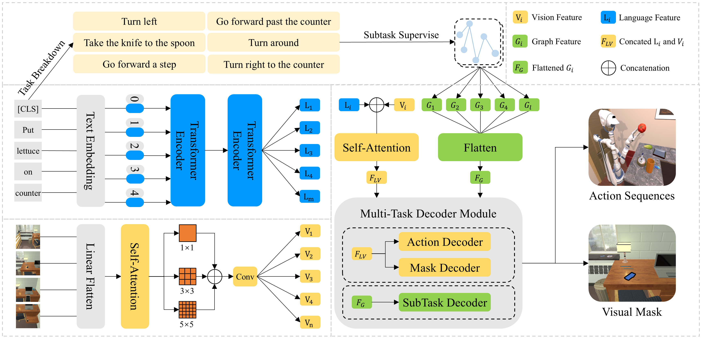

# Semantically-Guided Task Planning: Supervised Vision-Language-Action Model by Large Language Models

## Overview


**This repository serves as the official implementation of the paper "Semantically-Guided Task Planning: Supervised Vision-Language-Action Model by Large Language Models". In this work, we introduce the SS-VLA model designed for robot task planning. The model leverages the semantic understanding capabilities of Large Language Models (LLMs) combined with the generative strengths of Vision-Language-Action (VLA) models, leading to more precise and context-aware action sequence generation.**




## 1. INSTALLATION

Our code has been modified based on ALFRED. For basic usage information, please refer to  [**ALFRED's official GitHub page**](https://github.com/askforalfred/alfred).

You need to use the requirements.txt file from [**ALFRED's official GitHub page**](https://github.com/askforalfred/alfred) to install the necessary packages for our repository. And download the dataset(Trajectory JSONs and Resnet feats (~17GB)) following the guidance.

## 2.USAGE

After following the official tutorial to configure the environment and download the dataset, then train the model using the following commands.

```
python models/train/train_seq2seq.py --data data/json_feat_2.1.0 --model seq2seq_im_mask --dout exp/model:{model},name:pm_and_subgoals_01 --splits data/splits/oct21.json --gpu --batch 8 --pm_aux_loss_wt 0.1 --subgoal_aux_loss_wt 0.1
```

We also provide the code to retrain our SS-VLA model using Contrastive Learning(CL). You can access the code through this link: [**CL Code**](https://drive.google.com/file/d/1GaZPsHDj_M1BFShF-XFuXhTPVslyp17n/view?usp=sharing). If you are interested in this part, simply download the code from the link and replace the corresponding files in the original repository with the new code.


## 3.RESULTS

In our paper, we first use LLMs to break down the task instructions into subtasks, as illustrated in the following picture.


The following picture shows the action sequences generated by our model in the AI2THOR environment.


If you want to know more details about our work, please read the paper.